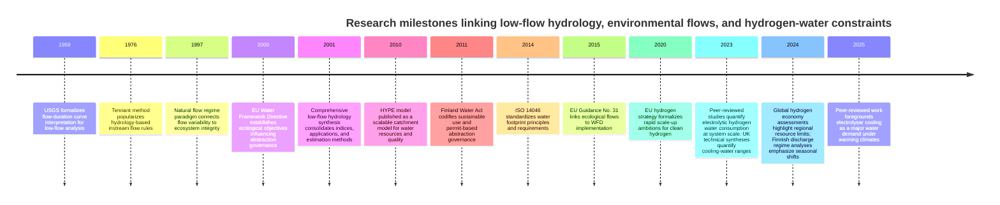

# Literature Review and Introduction Framework for a Draft Paper on Seasonal Water Availability for Green Hydrogen in

## Executive summary

The draft paper evaluates whether freshwater availability is a practical siting constraint for green hydrogen production (via water electrolysis) in a “water‑rich” setting, focusing on seasonal low flows in southern catchments. Using observed discharge, a calibrated semi‑distributed hydrological model, and scenarios for mid‑range climate change (SSP2‑4.5) and urban growth, the draft finds that summer and autumn low flows would constrain potential abstraction in a majority of subcatchments, and that climate‑driven changes in seasonal low flows dominate land‑use/urban growth effects. fileciteturn0file0

### Key background points for a strong Introduction

Hydrogen policy and investment pipelines are accelerating, particularly in Europe, making siting and “bankability” constraints (water, power, permits, social acceptance) newly salient. The European Commission’s hydrogen strategy sets out the EU’s intent to build a clean hydrogen value chain as part of decarbonisation, and the International Energy Agency’s annual hydrogen reviews track rapidly expanding electrolyser project pipelines, while noting that only a small share has reached final investment decision. citeturn3search4turn3search0turn3search1turn3search5

Green hydrogen has an irreducible process water requirement: electrolysis consumes water as feedstock, and in practice often requires additional raw water for treatment losses and for cooling depending on cooling technology. Industry and government syntheses converge on a stoichiometric baseline around 0.009 m³ per kg H₂ (≈9 L/kg) for demineralised process water, while reporting that cooling can add substantial additional gross and (sometimes) consumptive water use depending on system design. citeturn22search7turn24view0turn24view2turn24view3turn24view1 Recent peer‑reviewed work strengthens this framing by quantifying future global deionised water needs for electrolysers and (crucially) the potentially larger water requirements associated with evaporative cooling under warming climates. citeturn14view0turn24view23

Water may be “small” relative to electricity in system energy accounting, but water constraints become binding at local scales and during dry seasons, and can become material in life‑cycle and scarcity‑weighted sustainability assessments. For example, life‑cycle work on electrolytic hydrogen in decarbonised energy systems finds that direct process/feedstock water can be large at scale and that including water for electricity production can approximately double estimates in some scenarios. citeturn6view0turn18view0 A global prospective assessment of hydrogen economies similarly highlights region‑specific limitations, including the concentration of large low‑cost production potentials in water‑scarce regions. citeturn19view1 These results motivate Introduction language that treats water as a spatially heterogeneous constraint, not a uniform “minor input.”

Hydrological feasibility for abstraction is governed by low‑flow regimes and ecological requirements, not annual mean discharge. Low‑flow hydrology literature emphasizes that low flows represent the dry‑period functioning of catchments and are central for water‑supply planning and environmental flow management. citeturn2search13turn10view1 Environmental flows science frames why the magnitude, timing, duration, frequency and rate of change of streamflow matter for ecosystems. citeturn11search34turn24view21 At the policy interface, EU guidance on ecological flows under the Water Framework Directive provides a widely cited bridge between hydrologic indicators and regulatory practice. citeturn18view9turn11search22turn17search1

### Core gaps the Introduction can crystallize

A consistent gap across hydrogen siting and water‑energy studies is the mismatch between (i) the decision need (seasonal, local, permit‑relevant water availability under climate change) and (ii) common practice (annual averages or coarse national water indicators, often without environmental‑flow constraints). The draft directly targets this mismatch by moving from annual mean discharge to seasonal low‑flow indicators for siting. fileciteturn0file0 Framing this as a “decision‑relevance gap” (rather than only a “knowledge gap”) will strengthen motivation.

A second gap is geographic: most “hydrogen–water constraint” discussions emphasise arid/export regions, while fewer studies interrogate how temperate, lake‑rich, high‑latitude settings can still experience summer low‑flow bottlenecks and drought vulnerability in populated coastal regions. National and peer‑reviewed Finnish evidence shows that drought vulnerability is spatially uneven (coasts more vulnerable), and that summer/early autumn discharges can decrease as evapotranspiration rises and snowmelt timing shifts. citeturn6view2turn2search30turn9view0turn7view0

A third gap is socio‑technical: alternative water sourcing options (groundwater, managed aquifer recharge, interconnections) exist, but can face governance and social acceptance constraints. Finnish cases of managed aquifer recharge show both operational successes and contentious public debates, which can be used in the Introduction to motivate why “water availability” is not purely hydrologic. citeturn5search12turn5search0turn5search1turn24view11

## Extracted synopsis of the draft paper

### Themes, research questions, hypotheses, methods, and findings

The draft positions hydrogen electrolysis as expanding in Europe and the Baltic Sea region and argues that hydrogen projects require reliable freshwater access amid ecological constraints, permitting, and competing demands. fileciteturn0file0 It proposes that annual mean discharge is a poor indicator for siting and that seasonal low‑flow dynamics better represent binding constraints on abstraction feasibility. fileciteturn0file0

**Stated/implicit research questions (as written and as inferable):**
- How spatially and seasonally available are freshwater resources for potential hydrogen production sites in southern Finland? fileciteturn0file0  
- How do climate change (SSP2‑4.5) and urban growth affect seasonal low flows (Q10) across subcatchments? fileciteturn0file0  
- How different are siting conclusions when using seasonal low‑flow indicators versus annual mean discharge? fileciteturn0file0  

**Core hypotheses/claims:**
- Summer and autumn low flows constrain water availability in a large share of subcatchments under current conditions. fileciteturn0file0  
- Climate change reduces summer low flows and dominates urban growth effects at regional scales. fileciteturn0file0  
- Siting decisions improve when seasonal low‑flow indicators replace annual mean discharge. fileciteturn0file0  

**Methods and data (high‑level, for Introduction‑context summarising):**
- Combines observed discharge records with catchment‑scale hydrological modelling using the HYPE framework and scenario perturbations for SSP2‑4.5 climate change and urban growth. fileciteturn0file0  
- Model calibration: HYPE calibrated against measured daily discharge at outlet stations for 27 catchments comprising 1,158 subcatchments. fileciteturn0file0  
- Primary indicator: seasonal Q10 low‑flow statistic; an illustrative abstraction threshold of 0.05 m³/s is used for constraint screening. fileciteturn0file0  
- Tooling noted in draft: PEST is referenced for parameter estimation/calibration. fileciteturn0file0turn22search2  

**Key quantitative findings reported in the draft abstract and key points:**
- Under baseline conditions, 58.5% (summer) and 60.8% (autumn) of subcatchments fall below 0.05 m³/s, indicating widespread seasonal constraint even in a water‑rich region. fileciteturn0file0  
- Under SSP2‑4.5, summer Q10 decreases by a regional median of 24.4%; 98.7% of subcatchments show reduced summer low flows. fileciteturn0file0  
- Urban growth yields a negligible regional signal (median −0.43%), with climate change dominating urban effects by ~57:1. fileciteturn0file0  
- Winter Q10 increases under climate change (consistent with warmer winters shifting precipitation from snow to rain), implying seasonal counter‑trends that motivate seasonal production/storage strategies. fileciteturn0file0  

### Quick structured snapshot of the draft’s “Introduction needs” (to guide literature selection)

| Draft section (as written) | What it is trying to do | What the literature should supply |
|---|---|---|
| Motivation (hydrogen expansion + water constraints) | Justify why water matters for hydrogen siting | Policy + deployment signals; quantified water demands and cooling; evidence of water constraints in hydrogen planning citeturn3search4turn3search1turn14view0turn24view1 |
| Low‑flow approach | Defend Q10 and seasonality focus | Low‑flow hydrology, environmental flows, permitting practice, why annual means mislead citeturn2search13turn11search34turn18view9turn18view8 |
| Finland context | Explain “water‑rich but still constrained” | Finnish hydroclimate, drought vulnerability, observed regime shifts; spatial unevenness (coast vs inland) citeturn6view2turn7view0turn24view18turn2search30 |
| Options beyond surface water | Groundwater/MAR/desalination as alternatives, with social acceptance | Finnish MAR experience and contentious cases; governance constraints; water supply infrastructure examples citeturn5search1turn5search12turn5search0turn24view11 |

## Literature synthesis for building the Introduction

### Hydrogen scale‑up and why siting constraints are now “front‑of‑paper” material

The European hydrogen policy narrative emphasises rapid scale‑up of clean hydrogen value chains to decarbonise industry, transport and energy systems, and frames hydrogen as a strategic investment priority. citeturn3search4turn3search0turn18view7 Tracking reports show electrolyser capacity is growing but remains far from announced ambitions; the IEA reports highlight both rapid growth and the bottleneck that only a small fraction of announced capacity has reached final investment decision or construction. citeturn3search5turn3search1turn3search9

For the Baltic Sea region, hydrogen‑valley initiatives explicitly move hydrogen from abstract strategy to geographically situated projects with cross‑border infrastructure linkages; this supports an Introduction that anchors the case study region as part of an active investment pipeline rather than a hypothetical. citeturn3search22turn24view13turn3search10turn24view12

### Water requirements of electrolysis: feedwater, quality, and cooling

A strong Introduction should state (with sources) that electrolysis has an irreducible water feedstock requirement and that industrial designs often require demineralised water. Government and industry technical reviews repeatedly cite process water consumption ≈0.009 m³/kg H₂ (≈9 L/kg) as consistent with stoichiometry, and quantify additional water needs related to cooling system choices. citeturn22search7turn24view0turn24view2

Cooling is the hinge that turns “9 L/kg” into a potentially larger water story, especially for large installations and warm conditions. A recent peer‑reviewed assessment evaluates dry versus evaporative cooling and reports that meeting future hydrogen demand would require thousands of gigalitres per year of demineralised feedwater, with additional thousands to tens of thousands of gigalitres per year if evaporative cooling is used, and that the economics of cooling can favor evaporative approaches despite higher water use. citeturn14view0turn24view23 Complementary technical syntheses provide design‑study estimates where overall treated water consumption can be far above stoichiometric feedwater depending on efficiency and cooling configuration. citeturn24view3

A water‑availability Introduction can therefore cleanly distinguish:
1) **Irreducible feedwater** (order‑of‑magnitude 9 L/kg H₂),  
2) **Plant‑level withdrawals vs consumptive losses** (cooling method dependent),  
3) **Local hydrologic feasibility** (can the dry‑season river sustain permitted withdrawals while meeting ecological flow needs).

### Life‑cycle water use and scarcity‑weighted framing

Life‑cycle assessments show that “water impacts” are not limited to on‑site feedwater: upstream electricity supply, materials, and water treatment can matter, and results depend on energy mixes and technology pathways. citeturn6view0turn21view0turn20view0 A global prospective analysis of hydrogen economies reports a potential concentration of large production potentials in water‑scarce regions and highlights regional resource limits as a core sustainability risk. citeturn19view1turn19view0

For an Introduction focused on hydrologic availability, it is still useful to cite water‑scarcity footprinting standards and methods to position the paper within “water risk” discourse: ISO water footprinting provides principles and requirements for water footprint assessments, and AWARE provides a consensus model for scarcity footprints (available water remaining) used widely in LCA contexts. citeturn1search29turn1search25

### Why low flows, not annual means, govern abstraction feasibility and ecology

Low‑flow hydrology reviews emphasize that low flows are the dry‑period component of the hydrograph and are central to water‑supply planning, waste‑load allocation, and environmental flow management. citeturn10view1turn2search13 Environmental flows research frames “natural flow regime” components (magnitude, timing, frequency, duration, rate of change) as determinants of ecosystem structure and function, providing a canonical basis for arguing that seasonal abstraction decisions must respect low‑flow regimes. citeturn11search34turn24view21

Policy‑relevant ecological‑flow guidance under the Water Framework Directive explicitly ties hydrologic indicators to implementation needs for achieving ecological status, giving the Introduction a direct bridge from hydrology to permitting practice. citeturn18view9turn11search22

### Finland‑specific hydroclimate: “water‑rich” does not equal “low‑risk”

High‑latitude and boreal regions can have strong seasonality: warming winters can increase winter flows while summer and early autumn flows can decrease due to earlier snowmelt and higher evapotranspiration. A Finnish climate projection synthesis for SSP2‑4.5 quantifies expected warming and precipitation changes (with summer precipitation having larger uncertainty, particularly in the south), supporting a mechanistic explanation for summer low‑flow pressures. citeturn24view18turn9view0

Finnish national reporting similarly notes that summer and early autumn discharges are projected to mostly decrease and droughts can become more severe due to earlier spring and increased evapotranspiration. citeturn2search30 Empirical and modelling studies document drought impacts and regime shifts: a Finland‑focused drought modelling study highlights uneven vulnerability (coastal and more densely populated areas potentially more vulnerable) and discusses drought preparedness and permit review mechanisms under the national water act context. citeturn6view2turn24view16 A long‑term analysis of unregulated Finnish rivers reports timing shifts and seasonal redistribution of discharge volumes, reinforcing that “annual total volume unchanged” can coexist with meaningful seasonal change—precisely the intuition motivating seasonal low‑flow siting indicators. citeturn7view0turn24view17

### Alternative water sourcing and socio‑institutional constraints

Even if surface‑water low flows constrain abstraction, alternatives such as groundwater, managed aquifer recharge (MAR), and interconnections can moderate risk but introduce governance and social acceptance considerations. Finnish MAR experience has been documented as a major component of community water supply systems, and peer‑reviewed work shows that some Finnish MAR projects have proceeded well while others have faced resistance, motivating a nuanced Introduction statement that “hydrologic availability is necessary but not sufficient.” citeturn5search1turn5search12turn5search14 Prior research on public debates around a Finnish MAR project provides an empirical basis for describing “contentious” water‑sourcing decisions in Finland. citeturn5search0turn24view9 Regional raw‑water infrastructure examples (e.g., long‑distance raw‑water transfer tunnels for major urban water supply) further support the claim that water security is partly an infrastructure and governance construct, not only a local river‑flow condition. citeturn5search2turn24view11

### Land‑use change: why the draft’s “urban growth is secondary” finding is plausible

Urbanisation literature documents that increasing imperviousness alters infiltration and runoff pathways, often degrading stream hydrology and ecology beyond certain thresholds. citeturn11search1turn2search23turn2search19 A review of impervious surfaces and watershed planning synthesizes how imperviousness relates to water‑quality degradation and hydrologic change, providing background for why urban growth could influence low‑flow regimes through altered recharge, drainage networks, and baseflow. citeturn2search39turn2search23

At the same time, the draft’s result that climate dominates urban growth at regional scales can be framed as consistent with (i) moderate projected population growth relative to climate‑driven evapotranspiration shifts, and (ii) the dominance of hydroclimatic drivers in seasonal low flows in many boreal catchments—particularly where land‑use change is spatially limited or hydrologically buffered by lakes and aquifers. This should be explicitly positioned as a *hypothesis tested by the paper*, not merely asserted. fileciteturn0file0

### Small “anchor table” for Introduction clarity: water intensities cited in authoritative sources

| Component | Typical order of magnitude | Notes and use in Introduction |
|---|---:|---|
| Electrolysis feedwater (demineralised/process water) | ~0.009 m³/kg H₂ (≈9 L/kg) | Often presented as stoichiometric baseline; useful to clarify “irreducible demand.” citeturn22search7turn24view2 |
| Cooling water (consumptive losses, tower cooling) | ~0.005–0.018 m³/kg H₂ (≈5–18 L/kg) | Highly design‑dependent; relevant because cooling can rival or exceed feedwater at scale. citeturn22search7turn24view0turn14view0 |
| Total treated water in some conceptual designs | Tens of L/kg H₂ | Reported in technical design syntheses; reinforces that “9 L/kg” is not always the total site water footprint. citeturn24view3turn22search39 |

## Comprehensive annotated bibliography for an Introduction

The table is organized by **theme** and (within each theme) broadly **chronological** from seminal to recent work. “Link” is provided via the citation, while DOIs/identifiers are explicitly listed.

| Theme | Year | Source (citation) | DOI / ID | Annotation (2–3 sentences) | Relevance to this draft |
|---|---:|---|---|---|---|
| Policy & deployment context | 2020 | European Commission. *A Hydrogen Strategy for a climate‑neutral Europe.* citeturn3search4turn3search0 | CELEX: 52020DC0301 | Sets an EU‑level rationale and roadmap for scaling clean hydrogen across sectors, making hydrogen deployment a strategic near‑term policy priority. Provides authoritative context for why regional siting and resource constraints (including water) matter now. | Use to motivate urgency and European relevance of hydrogen siting constraints. |
| Policy & deployment context | 2024 | International Energy Agency. *Global Hydrogen Review 2024* (web report page). citeturn3search1turn3search5turn3search29 | Report (no DOI) | Tracks global hydrogen demand, low‑emissions hydrogen deployment, and electrolyser capacity pipelines; highlights large announced capacity vs smaller share reaching FID/construction. | Use for “scale‑up is real but uncertain; constraints and due diligence matter.” |
| Policy & deployment context | 2023–2026 | BalticSeaH2 project (Horizon/cordis + regional communication). citeturn24view13turn24view12turn3search6 | CORDIS ID 101112047 | Documents a concrete cross‑border hydrogen valley around the Baltic Sea region (southern Finland–Estonia focus), demonstrating regional momentum and siting decisions becoming practical. | Anchor for regional relevance: this is not hypothetical—projects are being organised in the region. |
| Electrolysis technology context | 2024 | JRC / CETO. *Water electrolysis and hydrogen in the European Union* (report). citeturn3search17 | JRC report ID (as issued) | Surveys status, trends, and maturity of electrolysis in the EU; useful for concise technical grounding (electrolyser technologies, market positioning). | Supports a brief technology paragraph that stays EU‑focused. |
| Hydrogen water demand & cooling | 2022 | entity["organization","Hydrogen Europe","industry association, brussels"]. *Hydrogen Production & Water Consumption* (factsheet). citeturn24view2turn22search3 | Report (no DOI) | Communicates the common “9 L/kg H₂” feedwater figure and positions water use relative to other fuels in energy terms. As an industry source, it is best paired with government/peer‑reviewed sources, but it is frequently cited in public discourse. | Use for a simple, quotable baseline—then immediately nuance with cooling and local constraints. |
| Hydrogen water demand & cooling | 2023 | Joint Environmental Programme (UK). *A Review of Water Use for Hydrogen Production.* citeturn24view0turn22search7 | Report ENG/22/PSP/EC/2957 | Provides consolidated estimates for process water and multiple cooling system configurations, separating gross withdrawals and consumptive use—exactly the distinctions needed for a hydrology‑focused siting paper. | Supplies credible engineering ranges to justify why low flows can matter even if feedwater is small. |
| Hydrogen water demand & cooling | 2024 | UK government (DESNZ) consortium report. *Water Demand for Hydrogen Production.* citeturn24view1turn22search23 | Report (no DOI) | Evaluates water demands for a future hydrogen economy, considers multiple raw water sources (potable, groundwater, surface water, wastewater), and frames the issue in a planning and resource‑pressure context. | Offers an authoritative planning‑oriented reference for “hydrogen water demand must be accommodated within existing water pressures.” |
| Hydrogen water demand & cooling | 2022 | Arup for Australian Hydrogen Council. *Water for Hydrogen* technical paper. citeturn24view3turn22search39 | Ref 286739‑00‑RPT‑001 | Compiles design‑study evidence for water needs (including treated water requirements) and discusses system design choices that change water demand. | Useful as an engineering synthesis to triangulate cooling/treatment assumptions. |
| Hydrogen water demand & cooling | 2025 | Ellersdorfer et al. “The hydrogen‑water collision…” *International Journal of Hydrogen Energy.* citeturn14view0turn24view23 | DOI: 10.1016/j.ijhydene.2024.11.381 | Quantifies global water and cooling demands for large‑scale green hydrogen under warming, highlighting the large additional water requirements of evaporative cooling and the techno‑economic tradeoffs vs dry cooling. | Provides a high‑impact recent peer‑reviewed anchor for the “cooling can dominate water demand” argument. |
| Hydrogen water demand & LCA | 2023 | Grubert. “Water consumption from electrolytic hydrogen…” *Cleaner Production Letters.* citeturn6view0turn18view0 | DOI: 10.1016/j.clpl.2023.100037 | Estimates consumptive freshwater intensity of electrolytic hydrogen at scale under decarbonised energy system scenarios; shows that direct process/feedstock water can be material and that including electricity water use can roughly double estimates in some scenarios. | Strengthens the paper’s framing that water is not always negligible and supports scaling arguments. |
| Hydrogen water demand & LCA | 2024 | Henriksen et al. “Tradeoffs in life cycle water use…” *International Journal of Hydrogen Energy.* citeturn21view0turn24view24 | DOI: 10.1016/j.ijhydene.2023.08.079 | Compares 11 hydrogen pathways with explicit attention to water requirements and highlights the importance of modelling water purification and pathway‑dependent tradeoffs between carbon and water footprints. | Supports a nuanced claim that “green” can shift burdens; motivates careful siting and footprint framing. |
| Hydrogen sustainability synthesis | 2024 | Terlouw et al. “Future hydrogen economies imply environmental trade‑offs…” *Nature Communications.* citeturn19view1turn18view3 | DOI: 10.1038/s41467-024-51251-7 | Global prospective assessment of hydrogen economies finds large environmental tradeoffs and identifies region‑specific limitations, including concentration of large production potentials in water‑scarce regions. | Provides a high‑visibility “why water constraints can limit hydrogen scale‑up” citation for the Introduction’s first page. |
| Water footprinting & scarcity methods | 2014 | ISO. *ISO 14046 Water footprint—Principles, requirements and guidelines* (illustrations/overview). citeturn1search29 | ISO 14046:2014 | Defines water footprint principles for products/organisations and is commonly cited as the standard framework underpinning water footprinting approaches. | Use to position the paper relative to broader water footprint / water risk discourse (even if paper itself is hydrologic, not LCA). |
| Water footprinting & scarcity methods | 2018 | Boulay et al. “AWARE…” *International Journal of Life Cycle Assessment.* citeturn1search25turn1search37 | DOI: 10.1007/s11367-017-1333-8 | Proposes the WULCA consensus scarcity footprint characterisation method (available water remaining) widely used for scarcity‑weighted footprints. | Optional—useful if Introduction includes a short “water scarcity vs availability” distinction. |
| Low‑flow hydrology foundations | 1959 | Searcy. *Flow‑Duration Curves* (USGS). citeturn23search20 | USGS WSP 1542‑A | Classic foundation for flow‑duration curves and interpretation of low‑flow curve ends as indicators of groundwater contribution and basin controls. | Helps justify FDC‑based percentiles conceptually, if needed. |
| Environmental flows foundations | 1976 | Tennant. “Instream flow regimens…” *Fisheries.* citeturn11search3turn11search11 | DOI: 10.1577/1548-8446(1976)001<0006:IFRFFW>2.0.CO;2 | Seminal hydrology‑based method (Montana/Tennant) for prescribing instream flow targets as fractions of mean annual flow; widely cited though also critiqued. | Useful background to contrast simplistic flow rules with the draft’s seasonal, spatially explicit approach. |
| Environmental flows foundations | 1997 | Poff et al. “The natural flow regime…” *BioScience.* citeturn11search34turn24view21 | DOI: 10.2307/1313099 | Establishes the natural flow regime paradigm and identifies key flow components that sustain ecosystems. | Strong conceptual anchor: supports why seasonal low flows matter for ecology and permitting. |
| Low‑flow hydrology synthesis | 2001 | Smakhtin. “Low flow hydrology: a review.” *Journal of Hydrology.* citeturn11search4turn10view1 | DOI: 10.1016/S0022-1694(00)00340-1 | Comprehensive review of low‑flow processes, indices, FDC methods, and applications in water management and environmental flows. | Directly supports the methodological legitimacy of focusing on low‑flow indices (like Q10) for management decisions. |
| Regulation & ecological flows | 2015 | EU CIS. *Ecological flows in the implementation of the Water Framework Directive* (Guidance No. 31). citeturn18view9turn11search22 | DOI: 10.2779/775712 | Provides an implementation‑focused synthesis linking flow regime alteration, abstractions, and ecological status under the WFD. | Supplies authoritative policy framing for why low flows enter permitting and river basin management. |
| Water law (Finland) | 2011 | Water Act (587/2011), unofficial English translation. citeturn18view8turn17search5 | National statute | Defines the legal objectives for sustainable use of water resources and the aquatic environment; provides the permit and governance context relevant to abstraction. | Use to justify why siting must consider permitting and harm thresholds, not only hydrology. |
| Finnish hydroclimate projections | 2021 | Ruosteenoja & Jylhä. “Projected climate change in Finland…” *Geophysica.* citeturn24view18turn9view0 | (Journal article; DOI not shown in source) | Provides CMIP6/SSP‑based temperature and precipitation projections for Finland, including quantified warming and precipitation changes and uncertainty structure (e.g., higher summer uncertainty). | Directly supports the SSP2‑4.5 scenario selection and hydroclimatic drivers for summer low‑flow decreases. |
| Finnish national impacts synthesis | 2017 | Finland NC7 climate impacts chapter (hydrology statements). citeturn2search30 | National report chapter | States that summer and early autumn discharges are expected to mostly decrease and drought severity can increase due to earlier spring and increased evapotranspiration. | Provides an official national “impacts” statement to motivate the problem in the Finnish context. |
| Finnish floods & seasonality modelling | 2010 | Veijalainen et al. “National scale assessment…” *Journal of Hydrology.* citeturn13view0turn12search25 | DOI: 10.1016/j.jhydrol.2010.07.035 | National‑scale hydrologic assessment using multiple climate scenarios and delta‑change approach, highlighting spatial heterogeneity and shifts in seasonality. | Supports methodological continuity (delta change) and the idea that impacts are not uniform across the country. |
| Finnish drought vulnerability & governance | 2019 | Veijalainen et al. “Severe Drought in Finland…” *Sustainability.* citeturn6view2turn24view16 | DOI: 10.3390/su11082450 | Models drought impacts on water supply and hydropower and discusses spatial unevenness of vulnerability (coasts vs water‑rich regions) plus drought planning and permit review mechanisms. | Strong reference for “Finland can be drought‑vulnerable locally; governance responses exist but need planning.” |
| Finnish discharge regime change | 2024 | Lintunen et al. “Changes in the discharge regime of Finnish rivers.” *Journal of Hydrology: Regional Studies.* citeturn7view0turn24view17 | DOI: 10.1016/j.ejrh.2024.101749 | Observational analysis shows timing shifts and seasonal redistribution of discharge volumes in unregulated rivers, with pronounced coastal trends. | Reinforces why annual means can hide decision‑relevant seasonal shifts, aligning with the draft’s premise. |
| Finnish extreme‑flow change | 2022 | Gohari et al. “A century of variations in extreme flow across Finnish rivers.” *Environmental Research Letters.* citeturn12search21turn12search6 | DOI: 10.1088/1748-9326/aca554 | Long‑term assessment of extreme flows, linking changes in low pulses to winter increases and summer decreases and highlighting spatial variation. | Supports the “changing extremes and seasonality” narrative for siting risk under climate change. |
| Finnish drought indices & local planning | 2023 | Ahopelto et al. “Drought hazard…” *Climate Services.* citeturn12search5turn12search17 | DOI: 10.1016/j.cliser.2023.100400 | Local‑scale drought hazard assessment under climate change; supports the need for sub‑basin scale analysis and drought planning. | Helps justify subcatchment‑scale resolution and the local nature of drought risk. |
| Urbanisation hydrology | 1997 | Booth & Jackson. “Urbanization of aquatic systems…” *JAWRA.* citeturn11search1turn11search9 | DOI: 10.1111/j.1752-1688.1997.tb04126.x | Documents how urbanisation can degrade stream form and function and discusses thresholds and mitigation limits. | Provides foundational support for including urban growth/imperviousness scenarios. |
| Urbanisation hydrology synthesis | 2002 | Brabec et al. “Impervious surfaces and water quality…” *Journal of Planning Literature.* citeturn2search39turn2search35 | DOI: 10.1177/088541202400903563 | Reviews impervious surface research, discusses threshold concepts and planning implications; links land cover change to hydrologic and water‑quality degradation. | Useful for framing land‑use change as a plausible but uncertain driver compared to climate. |
| Urban runoff guidance | 2026 update | US EPA. “Urbanization – Stormwater runoff.” citeturn2search23 | Guidance page (no DOI) | Provides a concise, accessible description of imperviousness effects on infiltration and runoff, with references to classic studies. | Optional citation for a brief explanatory sentence; use sparingly compared with peer‑reviewed work. |
| Managed aquifer recharge (Finland) | 2013 | Kurki et al. “Managed aquifer recharge in community water supply…” *Water International.* citeturn5search1turn24view8 | DOI: 10.1080/02508060.2013.843374 | Reviews Finnish MAR experience with attention to technical and socio‑economic framing, showing MAR as an established water supply tool in Finland. | Supports “alternatives exist” while emphasising system context beyond rivers. |
| Managed aquifer recharge practice | 2017 | Jokela et al. “Raw Water Quality and Pretreatment in MAR…” *Water.* citeturn24view10turn5search14 | DOI: 10.3390/w9020138 | Discusses Finnish MAR practice with focus on water quality and pretreatment, highlighting NOM removal and operational steps. | Useful if Introduction discusses water quality constraints for electrolysis and the relevance of pretreatment infrastructure. |
| MAR governance & conflict | 2021 | Laukka et al. “Creating collaboration for contentious projects on MAR…” *Hydrogeology Journal.* citeturn5search12turn18view11 | DOI: 10.1007/s10040-021-02334-y | Analyzes two Finnish cases to show how collaboration processes can help address resistance and conflict in MAR projects. | Provides evidence for a key point: alternative water sourcing can be socially constrained. |
| Public debates & risk framing | (year not captured in source snippet) | Lyytimäki et al. “Down with the flow…” (Helda record). citeturn5search0turn24view9 | (Check publisher record for DOI) | Empirical analysis of public debates shaping risk framing around a Finnish MAR project; demonstrates that water projects can trigger legitimacy and risk controversies. | Supports an Introduction sentence on social acceptance and the governance dimension of “water availability.” |
| Water supply infrastructure example | (institutional) | HSY. “Päijänne Tunnel…” (water supply description). citeturn5search2turn24view11 | Institutional page | Describes a major raw‑water transfer system securing water for >1 million residents, illustrating infrastructure approaches to water security. | Optional context for “supply security can be constructed via infrastructure,” relevant to the draft’s discussion of alternatives. |
| Hydrological modelling backbone | 2010 | Lindström et al. “Development and testing of the HYPE model…” *Hydrology Research.* citeturn22search12turn22search0 | DOI: 10.2166/nh.2010.007 | Foundational description of the HYPE model structure and applications across scales; supports credibility of using HYPE for catchment discharge simulation. | Core methods anchor (also referenced in the draft). |
| Hydrological modelling scale‑up | 2020 | Arheimer et al. “Global catchment modelling using World‑Wide HYPE…” *HESS.* citeturn22search33turn24view19 | DOI: 10.5194/hess-24-535-2020 | Demonstrates WWH application and stepwise parameter estimation and helps contextualize spatially extensive catchment modelling with open data. | Supports the “large‑domain, subcatchment modelling” legitimacy and reproducibility framing. |
| Environmental data (Finland) | 2025 | Finnish Environment Institute open data APIs (hydrology interface). citeturn17search9turn24view4 | Service documentation | Documents open API access to hydrologic observations and calculated values across thousands of stations/areas. | Supports transparency/reproducibility statements and data provenance. |
| Environmental data (Finland) | 2023 | Catchment delineation dataset (valuma‑aluejako). citeturn4search2turn24view6 | Dataset record | Describes the national catchment division hierarchy and scope; useful for spatial unit definition in the study. | Methods provenance; also helps justify subcatchment mapping fidelity. |
| Meteorological data (Finland) | 2025 | Finnish Meteorological Institute open data manual (WFS/WMS). citeturn24view5turn4search9 | Service documentation | Documents how FMI open data can be accessed and queried via stored queries and APIs. | Supports reproducibility for meteorological forcing and scenario handling. |
| Land cover data | 2018 | Copernicus CORINE Land Cover 2018 product description. citeturn4search3turn24view7 | Dataset metadata | Provides characteristics and mapping units for CLC2018 and context for interpreting land cover inputs. | Supports the land‑use/urban growth scenario construction and interpretation of land‑cover resolution limits. |

## Introduction outline with paragraph‑level citation suggestions, plus key sentences

### Suggested Introduction structure (paragraph granularity)

**Opening paragraph (problem + why now):**  
Position green hydrogen as a fast‑moving decarbonisation lever with concrete regional project pipelines, making siting constraints a near‑term issue rather than a distant one. Cite EU strategy + IEA pipeline tracking + BalticSeaH2. citeturn3search4turn3search5turn24view13turn24view12

**Paragraph on the “irreducible but locally binding” water requirement:**  
State the electrolysis feedwater requirement (~9 L/kg H₂) and note that water treatment and especially cooling can materially increase withdrawals/consumption depending on design. Use a “three‑layer” framing (feedwater vs withdrawals vs consumptive losses). Cite Hydrogen Europe (baseline), UK JEP/government reports (engineering ranges), and Ellersdorfer (peer‑reviewed cooling emphasis). citeturn24view2turn24view0turn24view1turn24view23

**Paragraph on why annual averages mislead (hydrology and ecology):**  
Explain that abstraction feasibility is governed by seasonal low flows and ecological flow requirements, not annual means. Cite Smakhtin (low‑flow hydrology), Poff (natural flow regime), and EU ecological flows guidance. citeturn10view1turn24view21turn18view9

**Paragraph on the policy/permitting interface:**  
Connect hydrologic indicators to permitting: ecological flows under WFD and national water law shape abstraction limits and drought responses. Use Water Act translation and WFD/ecological flow guidance. citeturn18view8turn18view9turn17search5

**Paragraph on the Finnish/boreal context and climate sensitivity:**  
Make the “water‑rich yet seasonally constrained” argument: coastal areas can be vulnerable, and climate change is expected to shift seasonality (winter increases, summer/early autumn decreases). Cite Ruosteenoja & Jylhä (SSP2‑4.5 projections), NC7 hydrology impact text, Veijalainen drought study, and recent discharge‑regime observations. citeturn24view18turn2search30turn24view16turn24view17

**Paragraph on other demands and alternatives (and why that doesn’t remove the problem):**  
Note competing water demands and the existence of alternatives (groundwater, MAR, interconnections), but emphasize governance and social acceptance constraints. Cite Kurki (Finnish MAR experience), Laukka (contentious MAR collaboration), and debate/risk framing work plus infrastructure example (Päijänne). citeturn5search1turn5search12turn5search0turn24view11

**Gap statement paragraph (what the literature lacks):**  
State that despite growing hydrogen–water literature, there is limited decision‑relevant mapping that integrates (i) subcatchment‑scale seasonal low‑flow dynamics, (ii) climate and land‑use scenarios, and (iii) siting implications in temperate/boreal “water‑rich” regions. Support with hydrogen water‑risk literature and low‑flow/ecological‑flow governance references. citeturn19view1turn10view1turn18view9

**Contribution paragraph (what this paper adds):**  
List 3–4 concrete contributions: calibrated hydrological model, Q10 seasonal mapping, scenario comparison, and demonstration that annual mean indicator changes siting decisions. Cite HYPE model foundation and (optionally) WWH/HYPE scale references. citeturn22search12turn24view19 fileciteturn0file0

### Suggested opening sentences and gap statements (copy‑ready options)

**Opening sentence options**
- “Green hydrogen projects are moving from strategy to geography: electrolyser pipelines and hydrogen valleys now require site‑level evidence that power, water, and permits can align in practice.” citeturn3search5turn24view13  
- “Water electrolysis has an irreducible water demand, yet hydrogen planning frequently treats water as a uniform, secondary input—an assumption that breaks down at local scales and during seasonal low‑flow periods.” citeturn22search7turn10view1turn24view23  

**Gap statement options**
- “Most hydrogen siting discussions quantify water demand, but fewer translate that demand into **seasonal, catchment‑specific feasibility** under environmental flow constraints and a changing hydroclimate.” citeturn18view9turn10view1turn24view18  
- “Even in high‑latitude regions regarded as water‑secure, observed and projected shifts in discharge seasonality imply that annual averages can mask summer constraints that are decisive for permitting and ecological risk.” citeturn24view17turn2search30turn24view16  

**Contribution sentence options**
- “We provide a decision‑oriented assessment of freshwater availability for hydrogen siting by replacing annual mean discharge with **seasonal Q10 low‑flow indicators** derived from a calibrated catchment model and observational records.” fileciteturn0file0  
- “By integrating SSP2‑4.5 hydroclimate change and urban growth scenarios, we show which driver dominates low‑flow constraints and how this dominance reshapes siting priorities across subcatchments.” fileciteturn0file0  

## Mermaid timeline and concept map, prioritized reading list, and full source list

### Mermaid timeline of research development



### Thematic concept map

```mermaid
flowchart TB
  H2[Green hydrogen scale-up] --> E[Electrolysis plants]
  E --> Wreq[Water requirement]
  Wreq --> Feed[Feedwater ~9 L/kg H2]
  Wreq --> Treat[Water treatment losses]
  Wreq --> Cool[Cooling water (design-dependent)]
  E --> Power[Renewable electricity constraint]

  Hydro[Hydrology] --> Low[Seasonal low flows (Q10)]
  Hydro --> Mean[Annual mean discharge]
  Low --> Feas[Abstraction feasibility]
  Mean --> Mislead[Can mislead siting decisions]

  Eco[River ecosystems] --> Eflow[Environmental flows / natural flow regime]
  Eflow --> Feas

  Gov[Governance] --> EUWFD[WFD ecological objectives]
  Gov --> FinLaw[National water permitting]
  EUWFD --> Feas
  FinLaw --> Feas

  Change[Change drivers] --> CC[Climate change]
  Change --> LU[Land use / urban growth]
  CC --> Low
  LU --> Low

  Alt[Alternatives] --> GW[Groundwater]
  Alt --> MAR[Managed aquifer recharge]
  Alt --> Infra[Interconnections]
  MAR --> Social[Social acceptance / conflict]
  Social --> Gov
```

### Prioritized reading list (top 15)

These are the most “load‑bearing” sources for writing a compelling Introduction aligned with the draft’s aims.

1) Terlouw et al. 2024, *Nature Communications* (hydrogen economies + regional water scarcity limits). DOI: 10.1038/s41467-024-51251-7. citeturn19view1  
2) Ellersdorfer et al. 2025, *International Journal of Hydrogen Energy* (cooling water as major driver). DOI: 10.1016/j.ijhydene.2024.11.381. citeturn24view23  
3) Smakhtin 2001, *Journal of Hydrology* (low‑flow hydrology review). DOI: 10.1016/S0022-1694(00)00340-1. citeturn11search4  
4) Poff et al. 1997, *BioScience* (natural flow regime). DOI: 10.2307/1313099. citeturn11search34  
5) EU CIS Guidance No. 31 (ecological flows implementing WFD). DOI: 10.2779/775712. citeturn18view9  
6) Water Act (587/2011) English translation (permitting and sustainable use framing). citeturn18view8  
7) Veijalainen et al. 2019, *Sustainability* (Finnish drought vulnerability + governance). DOI: 10.3390/su11082450. citeturn24view16  
8) Lintunen et al. 2024, *J. Hydrology: Regional Studies* (observed discharge regime shifts). DOI: 10.1016/j.ejrh.2024.101749. citeturn7view0  
9) Ruosteenoja & Jylhä 2021, *Geophysica* (SSP2‑4.5 projections for Finland). citeturn24view18  
10) Grubert 2023, *Cleaner Production Letters* (electrolytic hydrogen water at scale). DOI: 10.1016/j.clpl.2023.100037. citeturn6view0  
11) Henriksen et al. 2024, *International Journal of Hydrogen Energy* (LCA water–carbon tradeoffs + purification). DOI: 10.1016/j.ijhydene.2023.08.079. citeturn21view0  
12) UK JEP 2023 water use review (practical ranges; cooling configurations). citeturn24view0  
13) UK DESNZ 2024 water demand report (planning framing, water sources). citeturn24view1  
14) Kurki et al. 2013, *Water International* (Finnish MAR experience). DOI: 10.1080/02508060.2013.843374. citeturn5search1  
15) Laukka et al. 2021, *Hydrogeology Journal* (contentious MAR projects and collaboration). DOI: 10.1007/s10040-021-02334-y. citeturn5search12  

### Full list of all sources found and used in this report

To keep the list verifiable and non‑duplicative, the **full list is the union of the annotated bibliography entries above plus the following additional sources that were used for data/provenance or supporting context** (each with identifier and link via citation):

- International Energy Agency, *Global Hydrogen Review 2023* (contextual continuity). citeturn3search13turn3search21  
- Finland NC7 hydrology impact chapter (official statement on projected summer discharge decreases). citeturn2search30  
- Veijalainen et al. 2010, *Journal of Hydrology* (national scale climate impacts on flooding; delta‑change approach). DOI: 10.1016/j.jhydrol.2010.07.035. citeturn13view0  
- Gohari et al. 2022, *Environmental Research Letters* (century‑scale extreme flow change). DOI: 10.1088/1748-9326/aca554. citeturn12search21  
- BalticSeaH2 project website (general project framing). citeturn3search2turn3search34  
- Gasgrid Finland hydrogen information package (national market and safety context; optional). citeturn24view14turn3search30  
- Finnish Environment Institute catchment/division and hydrology data services (data provenance). citeturn24view4turn24view6turn4search4  
- Finnish Meteorological Institute open data documentation (meteorological data provenance). citeturn24view5turn4search13turn4search32  
- Copernicus CORINE Land Cover 2018 metadata (land cover provenance). citeturn24view7turn4search15  
- Booth & Jackson 1997 + Brabec 2002 + EPA stormwater guidance (urbanisation hydrology background). citeturn11search1turn2search39turn2search23  

